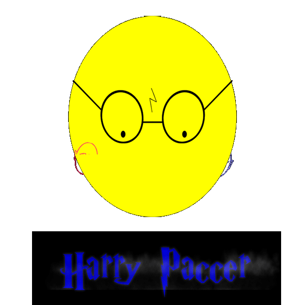
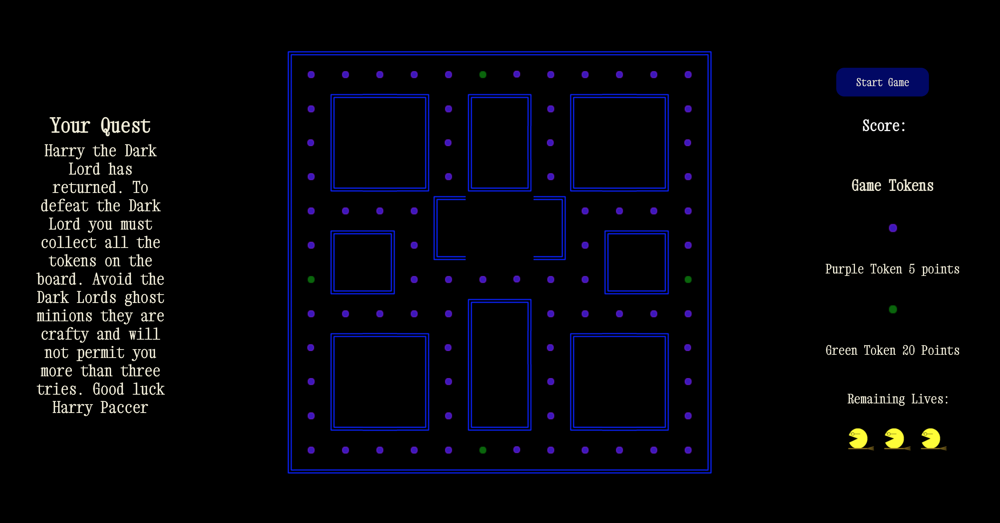
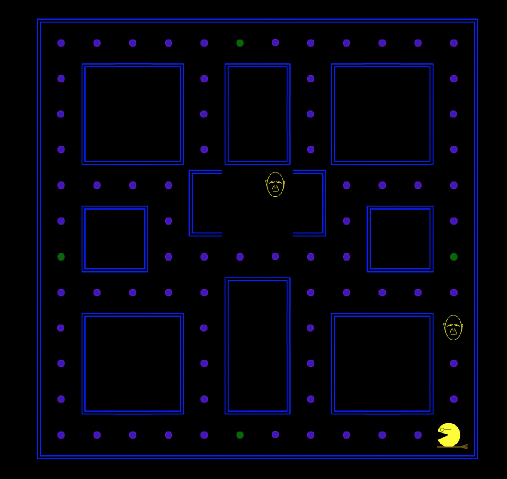
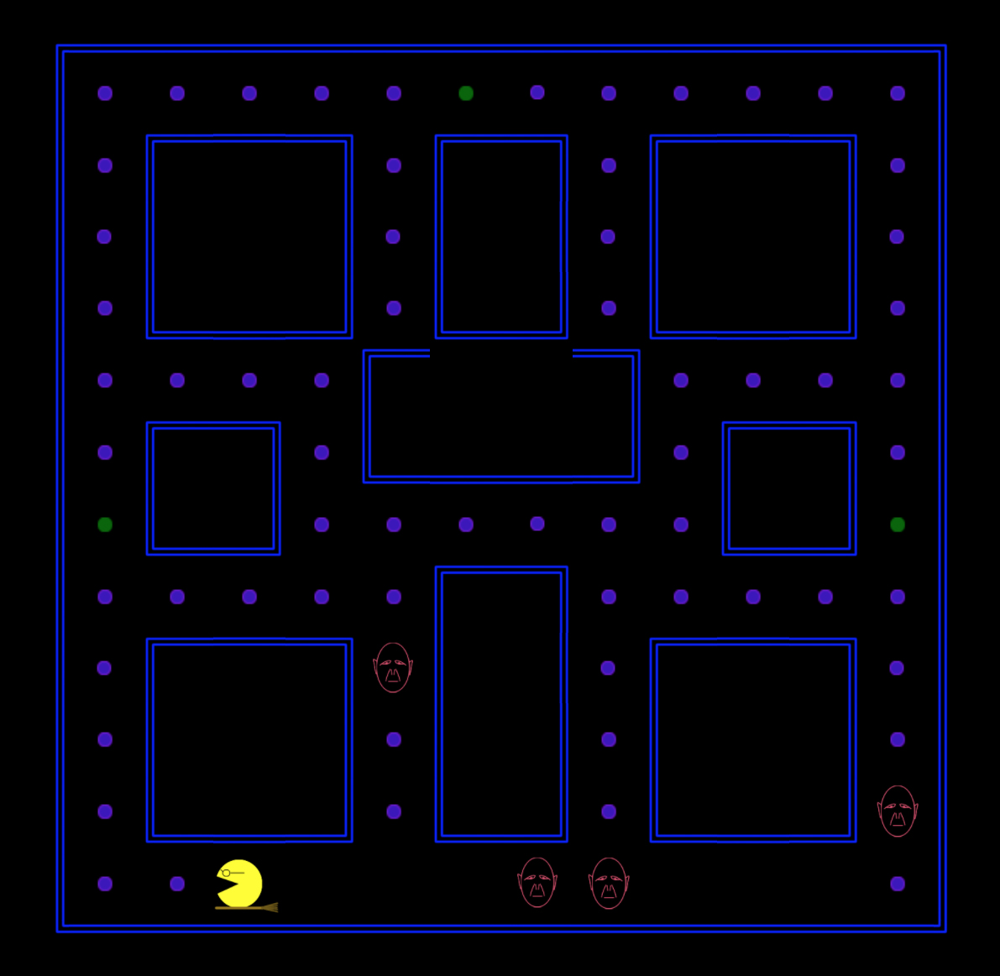
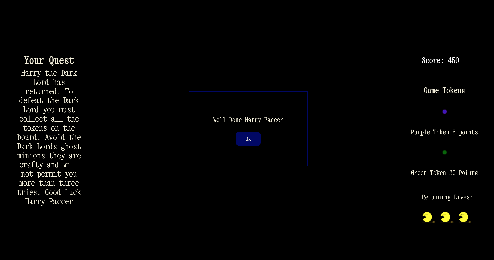
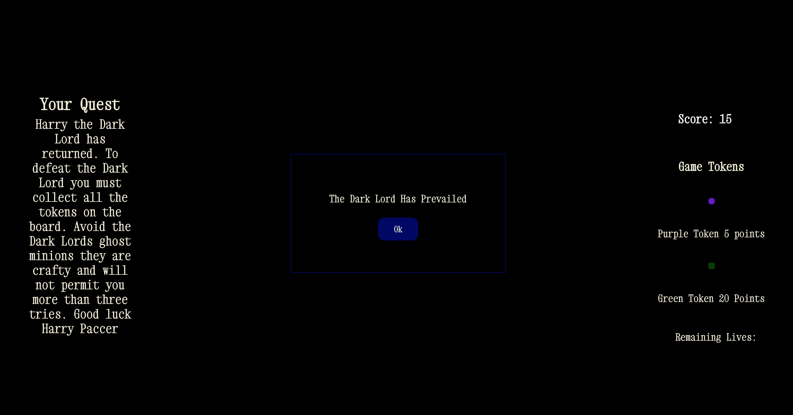

<H1>SEI-Project One: Pac Man </H1>
<h2>Project Brief</h2>
<p>Pac Man is a classic arcade game from the 80s. The player aims to eat all the food in a maze whilst being hunted by ghosts.</p>

<p>This was the first project I completed in General Assembly’s Immersive Software Engineering course. In project one I was tasked with creating a single page game constructed from HTML, CSS and JavaScript only over a 7 day period</p>

<h2>Technologies used</h2>
<ul>
<li>HTML5 & HTML5 Audio</li>
<li>CSS</li>
<li>Vanilla JavaScript</li>
<li>Github</li>
<li>Google Fonts</li>
<li>Photoshop</li>
</ul>

<h2>The Game: Harry Paccer</h2>

#       

<h3>Game Overview</h3>
<p>Harry Paccer is a Harry Potter themed Pac Man. A player must collect all the purple and green tokens, while avoiding the Voldemort ghosts. A player is given three lives each time a player comes into contact with a ghost they lose a life.</p>

<h3>How to Move Harry</h3>
<p>Harry is controlled using: ↑ ↓ ← →  arrow keys</p>

You can find a live version of the app here: [Harry Paccer](https://timjframe.github.io/sei-project-1/)

<h3>Game Instructions</h3>

<ol>
<li> When a player first arrives on the page they are greeted by an animated gif with a play game button to enter the game.</li>


# 

<li>Once the player has clicked the, 'Play Game' button they are taken to home page of game. Here the player is given a breif overview of the game on the left-hand side of the screen. On the right-hand side of the screen a player can begin the game, track there score, find out how many points a token is worth and see the amount of remaining lives available.</li>

#  

<li>To begin the game the player clicks the start game button. At this point 'Harry Paccer' will appear in the bottom right hand side of the screen and the voldermort ghost will start entering the game via the center box. As soon as the ghosts appear on the screen they will start moving towards Harry's direction.</li>


#  

<li>From here the player needs to collect all the tokens on the board. If a player collects a green token the voldemort ghosts will begin to flash. When a ghost is flashing Harry won't lose any lives if he comes into contact with a ghost and is able to eat the ghost. This will send the eaten ghost back to its starting position. Also while a ghost is flashing its tracking function is disabled and they will only move in random movements.</li>

#  

<li>If a player collects all the tokens thet are shown the winning message and once the player clicks on the 'ok' button they are taken back to the animated gif on the landing page.</li>

#  

<li>If a player loses they are shown the losing message and once the player clicks on the 'ok' button they are taken back to the animated gif on the landing page.</li>

#  
</ol>

<h2>Creating the Game</h2>

<h3>The Board</h3>
<p>I created the board in JavaScript by using a series of div’s in a 14x14 div grid that came to a total of 196 squares that were held in an array. Each character was applied to the board as a CSS background image and given a starting position that corresponded to the index position of a grid div in the array. This meant a character could be moved horizontally by increasing or decreasing the div index position by 1. For the vertical movement a characters div index would be increased by the width of the board to move down and decreased by the width of the board to move up.</p>

<p>To make the obstacles in the game I created a series of arrays that held the div index’s of the div’s that would be used as obstacles. For example all the right corner blocks would be held in one array and all the left-hand blocks would be in another. This allowed me to loop over each array and apply the images to the given divs index and also apply a data-id of ‘block’ to each obstacle. I found the data-ids really useful when it came to limiting the characters movement on the board. Both Harry and the Voldemorts would always test one div ahead of their position when they were moving. If a div contained a ‘block’ data-id the character would be prevented from moving any further.</p>

<p>The code snippet below is creating the grid and game board.</p>


```
//*Board Functions
	
  //*Creates grid for game
  function createGameGrid(){
    for (let i = 0; i < gridCellCount; i++){
      const cell = document.createElement('div')
      // cell.innerHTML = i
      grid.appendChild(cell)
      cells.push(cell)
    }
  }

  //*Running function to create grid
  createGameGrid()

 

  //*Creates border for game
  function createGameBorder(){
    for (let i = 1; i < 13; i++){
      cells[i].classList.add('top-border')
      cells[i].setAttribute('data-id', 'block')
    }
	
    for (let i = 183; i < 195; i++){
      cells[i].classList.add('bottom-border')
      cells[i].setAttribute('data-id', 'block')
    }

    for (let i = 14; i < 182; i += 14){
      cells[i].classList.add('left-side-border')
      cells[i].setAttribute('data-id', 'block')
    }

    for (let i = 27; i < 195; i += 14){
      cells[i].classList.add('right-side-border')
      cells[i].setAttribute('data-id', 'block')
    }

    cells[0].classList.add('top-left-corner-border')
    cells[0].setAttribute('data-id', 'block')
    cells[13].classList.add('top-right-corner-border')
    cells[13].setAttribute('data-id', 'block')
    cells[182].classList.add('bottom-left-corner-border')
    cells[182].setAttribute('data-id', 'block')
    cells[195].classList.add('bottom-right-corner-border')
    cells[195].setAttribute('data-id', 'block')
  }

  //*Running function to create border
  createGameBorder()

  //*Creates Blocks for Game
  function createGameBlocks(){
    //*Builds bottom left corner blocks
    const bottomLeftCornerBlockArray = [58, 65, 62, 89, 100, 108, 156, 163, 160]
    bottomLeftCornerBlockArray.forEach(item =>{
      cells[item].classList.add('block-bottom-left-corner')
      cells[item].setAttribute('data-id', 'block')
    })
    //*Builds bottom right corner blocks
    const rightBottomCornerArray = [60, 67, 63, 92, 109, 158, 165, 161, 101]
    rightBottomCornerArray.forEach(item => {
      cells[item].classList.add('block-bottom-right-corner')
      cells[item].setAttribute('data-id', 'block')
    })

    //*Builds top left corner blocks
    const topLeftCornerArray = [30, 37, 34, 86, 94, 128, 135, 118, 75 ]
    topLeftCornerArray.forEach(item => {
      cells[item].classList.add('block-top-left-corner')
      cells[item].setAttribute('data-id', 'block')
    })

    //*Builds top right corner blocks
    const topRightCornerArray = [32, 39, 35, 78, 87, 130, 137, 119, 95]
    topRightCornerArray.forEach(item => {
      cells[item].classList.add('block-top-right-corner')
      cells[item].setAttribute('data-id', 'block')
    })

    //* Builds top blocks
    const topBlockArray = [31, 38, 129, 136]
    topBlockArray.forEach(item => {
      cells[item].classList.add('block-top-side')
      cells[item].setAttribute('data-id', 'block')
    })

    //*Builds bottom blocks
    const bottomBlockArray = [59, 66, 157, 164]
    bottomBlockArray.forEach(item =>{
      cells[item].classList.add('block-bottom-side')
      cells[item].setAttribute('data-id', 'block')
    })

    //*Build right blocks
    const rightBlockArray = [46, 53, 49, 144, 151, 133, 147]
    rightBlockArray.forEach(item =>{
      cells[item].classList.add('block-right-side')
      cells[item].setAttribute('data-id', 'block')
    })

    //*Builds left blocks
    const leftBlockArray = [44, 48, 51, 132, 142, 146, 149]
    leftBlockArray.forEach(item => {
      cells[item].classList.add('block-left-side')
      cells[item].setAttribute('data-id', 'block')
    })
  }
```

<h3>Functionality</h3>

<h4>Player Movement</h4>
<p>Next I implemented Harrys movement. Here I used a switch statement that checked what arrow key had been pressed using keyboard event keycodes. Once the keycode was determined the correct movement was returned by the switch statement. At this point I found that Harry would need to be rotated to give more realistic vertical movement and flipped to give a more realistic horizontal movement. For the vertical movement I used a series of CSS classes with different degrees of rotation and for the horizontal movement I flipped the original Harry gif in photoshop and applied it to a new CSS class. </p>

<p>The code snippet below is used to move harry around the board.</p>

```
function handleKeyUp(e){
    if (isGameStarted === 'yes'){
      
      removeHarry()
      removeFlipHarry()
      removeRotateHarryUp()
      removeRotateHarryDown()
    
      const horizontalPosition = harryPosition % width
      const verticalPosition = Math.floor(harryPosition / width)

		
      switch (e.keyCode){
        case 39: //*Move Right
          if (horizontalPosition < width - 1 && cells[harryPosition + 1].dataset.id !== 'block') 
            harryPosition++
          flipHarry()
          harryLosesLife()
          harryEatsFood()
          harryEatsSpecialFood()
          
          break
        case 37://*Move Left
          if (horizontalPosition > 0 && cells[harryPosition - 1].dataset.id !== 'block') 
            harryPosition--
          addHarry()
          harryLosesLife()
          harryEatsFood()
          harryEatsSpecialFood()
          
          break
        case 38://*Move Up
          if (verticalPosition > 0 && cells[harryPosition - width].dataset.id !== 'block')
            harryPosition -= width
          rotateHarryUp()
          harryLosesLife()
          harryEatsFood()
          harryEatsSpecialFood()
          
          break
        case 40://*Move down
          if (verticalPosition < width - 1 && cells[harryPosition + width].dataset.id !== 'block') 
            harryPosition += width
          rotateHarryDown()
          harryLosesLife()
          harryEatsFood()
          harryEatsSpecialFood()
          
          break
        default:
          console.log('invaild key')
     
      } 
```


<h4>Voldemort Ghost Movement</h4>
<p>The next step was getting the Voldemort ghosts to move. The ghosts needed to move randomly but also track Harry’s movement. For the random movement I made an array of movements and created a function that would randomly pick a movement. From there I used an if statement that would apply the movement that corresponded to the randomly selected movement.</p>
<p>For the tracking movement I compared Harry’s position to the Voldemort’s position on the board and then used a series of if statements to move the ghosts closer to Harry.</p>


<p>The code snippet below is randomising the Voldemort ghost movements.</p>


```
//*Array used in if statement to move voldemort ghosts
  const voldemortMovements = ['left', 'right', 'up', 'down']

  //*Returns a random movement
  function randomiseVoldemortMovements(){
    return voldemortMovements[Math.floor(Math.random() * voldemortMovements.length)]
  }

  //*moveVoldemort controls the random movement of the voldemort ghosts using setInterval timer
  function moveVoldemort(index, timer){
    
    if (timer){
      return
    }
   
    //*Tests if harry has eaten green food if so sets class to special ghost
    timer = setInterval(() => {
      if (didHarryEatSpecialFood === 'yes'){
        removeSpecialVoldemorts(index)
        removeVoldemorts(index)
      } else if (didHarryEatSpecialFood === 'no') {
        removeSpecialVoldemorts(index)
        removeVoldemorts(index)
      }
     
      
      if (randomiseVoldemortMovements() === 'left'){
        //*Move Left
        if (cells[voldemorts[index].position - 1].dataset.id !== 'block'){
          voldemorts[index].position--
        } 
        //*Move Right
      } else if (randomiseVoldemortMovements() === 'right'){
        if (cells[voldemorts[index].position + 1].dataset.id !== 'block'){
          voldemorts[index].position++
        }
        //*Move Up
      } else if (randomiseVoldemortMovements() === 'up'){
        if (cells[voldemorts[index].position - width].dataset.id !== 'block'){
          voldemorts[index].position -= width
        }//*Move Down
      } else if (randomiseVoldemortMovements() === 'down'){
        if (cells[voldemorts[index].position + width].dataset.id !== 'block'){  
          voldemorts[index].position += width
        }
      }
```

<h3>Game Logic</h3>
<p>The first piece of game logic I began creating was a function that took a life from a player when the player came into contact with a ghost and moved Harry back to his initial starting point on the board. From there I moved onto creating a function that dealt with the player losing all three lives, displaying an error message and ending the game. At this point I created an ‘end of game’ function that could be easily updated to handle a winning game or a losing game when the logic can been created.</p>

<p>The code snippet below is contains the functions that deal with Harry losing a life, a winning game outcome and a losing game outcome.</p>

```
//*Moves harry back to original starting position and removes one life when Harry intersects with Voldemort
  function harryLosesLife(){
    
    if (cells[harryPosition].className.includes('voldemort')){
      
      for (let i = 0; i < cells.length; i++){
        cells[i].classList.remove('harry')
        cells[i].classList.remove('flip-harry')
        cells[i].classList.remove('rotate-harry-up')
        cells[i].classList.remove('rotate-harry-down')
      }
      harryLives -= 1
      harryPosition = 180
      addHarry()
      if (harryLives === 2){
        life1.style.display = 'none'
      } else if (harryLives === 1){
        life2.style.display = 'none'
      } else if (harryLives === 0){
        life3.style.display = 'none'
        playerLost()
      }
    }
  }
```
<p>The next stage in my process was creating a function that dealt with harry eating tokens and adding each eaten token to the players score. Once this was working I created a function that to display a winning message when all the tokens on the board were eaten and incorporated this into the ‘end of game function’.</p>

<p>The last important piece of functionality was a function to be used when Harry ate a green token. When this happened all of the Voldemort ghosts had a new CSS class applied for a short period of time. While the special class was applied the ghosts tracking logic was disabled and Harry would not lose any lives if he came into contact with a ghost and was also able to eat a ghost and send it back to its starting position.</p>

<p>At this point all the core logic of the game was working. From here I created another function that moved the Voldemort ghosts onto the board more smoothly. Prior to this it had been a bit janky. Then I created a game timer function that used a series of setIntervals and setTimeouts to get the game logic working in sync. Lastly I made a function that would play, ‘Hedwig’s Theme Song’ when a player clicked the ‘play game’ button on the home page.</p>

<h2>Challenges</h2>
<p>The game had a lot of moving pieces that needed to work in sync. I found this to be particularly true with the logic that was used to move the ghosts. Because I had one piece of logic that would randomly moved the ghosts at all times and another to track Harry, I found that the random movement logic at times would interfere with the tracking logic.</p>

<h2>Wins</h2>
<p>I feel that the biggest win for me wasn’t one single piece of code but being able to have multiple functions carrying out different tasks but at the same time working cohesively as one program.</p>

<h2>Learnings</h2>
<p>Building the game really taught me the importance of having a good plan, forming a clear direction and testing each piece of code as you write it. This whole process has really solidified my vanilla JavaScript skills.</p>


<h2>Future Features</h2>
<p>If I had more time, I would like to:</p>
<ul>
<li>Make the game mobile responsive and controllable on a touch screen.</li>
<li>Make the ghost tracking logic more robust.</li>
<li>Give the player options to be different characters.</li>
<li>Add another level.</li>
</ul>


